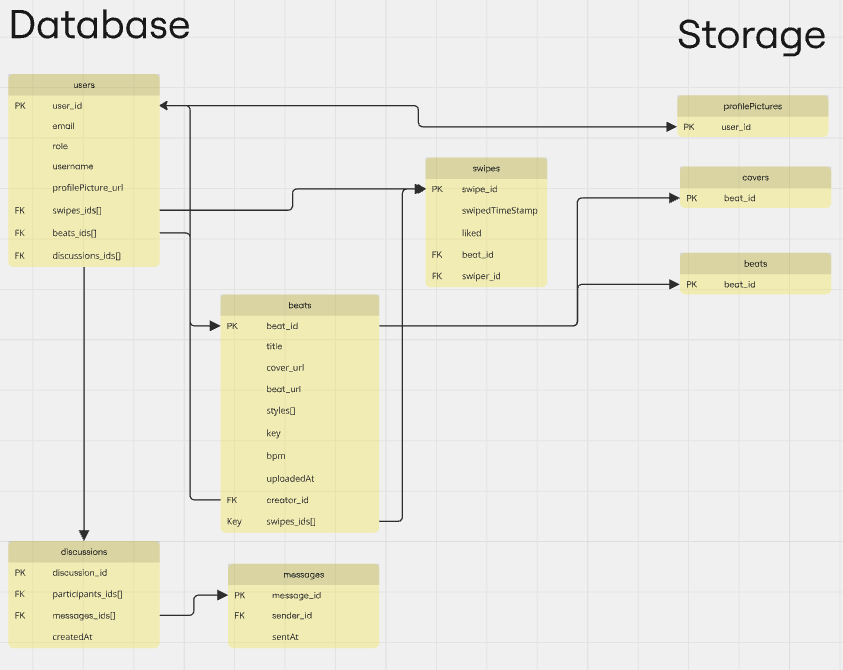

# MUSE

MUSE is a **mobile app** in react native for independent artists to find and purchase beats, quick and easy.

## Features

- Post beats for sale
- Swipe through beats like tinder
- Purchase beats
- Chat with the artist
- View your sales / views / statistics
- Library of liked / purchased beats

## Tech Stack

- React Native
- Typescript
- Tailwind CSS
- Firebase
- Lightning Network

## Demo

  <video width="400" src="https://github.com/user-attachments/assets/596ba87f-8ac0-4d13-b66f-958f6cc50f68"></video>

  

    

      
      
      
    

    

      
      
    

  

## Database Schema

## About tech choices

### Database

We are using **firebase** for the database because it is easy to use and it is a reliable database.

### UI/app

The UI/app is built using react-native, which gives us the performance of a native app on both iOS and Android with development convenience of Javascript.

### Payment

We thought that **lightning network** would be the best way to handle the payment because it is fast and cheap.

We wanted to be awat from centralized payment processors like **stripe** and **paypal** because we wanted to be able to handle the payment without any third party.

Uses lnd as a daemon/library because it fully conforms to the BOLT specifications and is easy to cross-compile and run on mobile platforms.

Architecture looks like: react-native -> (glue) -> lnd

glue here is the native code (Java on Android and objC on iOS) that allows react-native to manage and call lnd. glue let's us:

- start, stop and query the state of lnd,
- write, read files, scan QR codes,
- make REST calls to lnd,
- on Android, manages the background lnd process.

On Android, the lnd daemon is isolated in it's own process, so it's easier to manage and when it hangs or shutdowns, the whole process is removed, keeping the app's own process "clean" and makes it more difficult for native code to crash the app.

On iOS, lnd runs in the same process as the main app and there are far more restrictions on memory/cpu/processes, so when the wallet is closed, the user can't reopen another wallet without quitting the app.

## TODO

- [ ] Add MPC login method such as Web3Auth
- [ ] Add OnRamp and OffRamp solution
- [ ] Make the blockchain less visible to the user
- [ ] Add possibility to filter beats by genre, bpm, key, etc.

## Licence

Ce code appartient entièrement à Leo Combaret et Idir Guettab. Il est interdit de l'utiliser a d'autres fin que pour l'enseignement.
